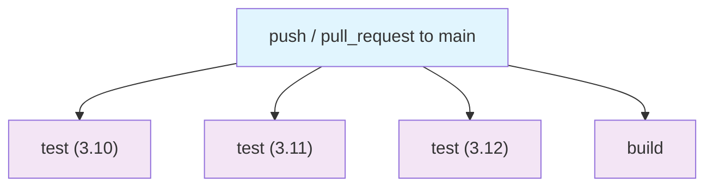

## Workflow Overview

**Purpose**: Verify on every change that `dh-healthdcat` installs and its test
suite passes across all supported Python versions, and that its packaged
distribution (wheel) is self-contained.
**Trigger Events**: `push` to `main`; `pull_request` targeting `main`.
**Target Environments**: GitHub-hosted `ubuntu-latest` runners only. No
deployment target — this workflow validates code, it does not ship it.

## Execution Flow Diagram



`test` (all matrix legs) and `build` have no inter-job dependency — all four
run in parallel. `fail-fast: false` on the `test` matrix means one Python
version failing does not cancel the others.

## Jobs & Dependencies

| Job Name | Purpose | Dependencies | Execution Context |
|----------|---------|--------------|-------------------|
| test (3.10, 3.11, 3.12) | Editable install + run unit test suite | None | `ubuntu-latest`, matrix of 3 |
| build | Build wheel, install non-editably, smoke-test packaged data | None | `ubuntu-latest` |

## Requirements Matrix

### Functional Requirements
| ID | Requirement | Priority | Acceptance Criteria |
|----|-------------|----------|-------------------|
| REQ-001 | Run the unit test suite on every supported Python version | High | `test` job green on 3.10, 3.11, and 3.12 |
| REQ-002 | Verify the package builds into a valid wheel | High | `uv build` exits 0, produces `dist/*.whl` |
| REQ-003 | Verify the wheel is self-contained (no reliance on the source tree) | High | CLI entry point (`dh-healthdcat --help`) and packaged non-Python data (vocab YAML files, SHACL shapes) load correctly from a fresh, non-editable install |

### Security Requirements
| ID | Requirement | Implementation Constraint |
|----|-------------|---------------------------|
| SEC-001 | Workflow must not have write access to repository contents | `permissions: contents: read` at workflow level |
| SEC-002 | No secrets are consumed | Workflow requires no DataHub or HDH credentials — the test suite runs entirely against an offline fixture (`tests/fixtures/fake_datahub.py`), never a live instance |

### Performance Requirements
| ID | Metric | Target | Measurement Method |
|----|-------|--------|-------------------|
| PERF-001 | Superseded runs are cancelled | New push on same ref cancels in-flight run | `concurrency` group with `cancel-in-progress: true` |

## Input/Output Contracts

### Inputs

```yaml
# Environment Variables
# (none — no environment variables are consumed by this workflow)

# Repository Triggers
paths: [not path-filtered — runs on every push/PR touching main]
branches: [main]
```

### Outputs

```yaml
# Job Outputs
# (none published — jobs communicate only via pass/fail status)
dist_wheel: file  # Description: dh_healthdcat-*.whl, built and consumed within the build job; not uploaded as a workflow artifact
```

### Secrets & Variables

| Type | Name | Purpose | Scope |
|------|------|---------|-------|
| — | — | None used | — |

## Execution Constraints

### Runtime Constraints

- **Timeout**: Not explicitly set — defaults to GitHub Actions' 360-minute job limit (workflow is expected to complete in well under a minute per job)
- **Concurrency**: One active run per `(workflow, ref)` pair; superseded runs are cancelled
- **Resource Limits**: Standard GitHub-hosted runner limits (2-core, 7 GB RAM)

### Environmental Constraints

- **Runner Requirements**: `ubuntu-latest`, no OS-specific dependencies
- **Network Access**: Outbound only, to install dependencies (PyPI via `uv`) and checkout the repository — no inbound access, no access to DataHub or HDH endpoints
- **Permissions**: `contents: read` only

## Error Handling Strategy

| Error Type | Response | Recovery Action |
|------------|----------|-----------------|
| Dependency install failure (any Python version) | Job fails, others in matrix continue (`fail-fast: false`) | Inspect `uv pip install -e ".[dev]"` log; typically a transitive dependency resolution conflict on that Python version |
| Test failure | Job fails, `pytest` output shows failing assertion | Fix the failing code or test; the fixture is fully offline so failures are reproducible locally with `uv run pytest` |
| Wheel build failure | `build` job fails at `uv build` | Check `pyproject.toml` hatchling configuration |
| Packaged data missing (vocab YAML / SHACL shapes) | `build` job fails at the embedded-data smoke test | Check `[tool.hatch.build.targets.wheel]` packaging rules; the file was added under `src/dh_healthdcat/` but not included in the wheel |

## Quality Gates

### Gate Definitions

| Gate | Criteria | Bypass Conditions |
|------|----------|-------------------|
| Test suite | All tests pass on all 3 Python versions | None — required for merge readiness signal (no branch protection rule currently enforces this) |
| Package integrity | Wheel builds and its CLI + embedded data load post-install | None |

## Monitoring & Observability

### Key Metrics

- **Success Rate**: Not tracked externally — visible via GitHub Actions run history on `main`
- **Execution Time**: Not tracked — expected to be under ~2 minutes total (no heavy build steps, `uv` caching enabled via `enable-cache: true`)
- **Resource Usage**: Not monitored (standard hosted-runner workload)

### Alerting

| Condition | Severity | Notification Target |
|-----------|----------|-------------------|
| Workflow failure on `main` | N/A | GitHub's default UI/email notification to the repository owner — no custom alerting configured |

## Integration Points

### External Systems

| System | Integration Type | Data Exchange | SLA Requirements |
|--------|------------------|---------------|------------------|
| PyPI | Dependency resolution/download | Package downloads via `uv` | None (best-effort) |

Not applicable: this workflow has no runtime dependency on DataHub or the HDH
API — that is precisely what its test fixture exists to avoid.

### Dependent Workflows

| Workflow | Relationship | Trigger Mechanism |
|----------|--------------|-------------------|
| — | None — this is the only workflow in the repository | — |

## Compliance & Governance

### Audit Requirements

- **Execution Logs**: Retained per GitHub Actions default repository retention policy; not customized
- **Approval Gates**: None — no environment protection rules or required reviewers configured
- **Change Control**: Changes to this workflow follow the repository's standard Conventional Commits + direct commit process (see `CONTRIBUTING.md`); no separate CI-change approval process exists

### Security Controls

- **Access Control**: `permissions: contents: read` restricts the default `GITHUB_TOKEN` to read-only
- **Secret Management**: Not applicable — no secrets are used
- **Vulnerability Scanning**: Not performed by this workflow (out of scope; not requested)

## Edge Cases & Exceptions

### Scenario Matrix

| Scenario | Expected Behavior | Validation Method |
|----------|-------------------|-------------------|
| Push directly to `main` | `test` (×3) and `build` all run | GitHub Actions run list |
| Pull request targeting `main` | Same 4 jobs run against the PR's merge commit | GitHub Actions run list |
| Push to a non-`main` branch | Workflow does not trigger | No run appears for that push |
| Two pushes to the same branch in quick succession | First run is cancelled, only the latest runs to completion | `concurrency.cancel-in-progress: true` |
| A dependency (e.g. `acryl-datahub`) drops support for Python 3.10 | The corresponding matrix leg fails while 3.11/3.12 stay green (`fail-fast: false`) | Job-level status per matrix leg |

## Validation Criteria

### Workflow Validation

- **VLD-001**: `uv run pytest` must report 14/14 tests passing on each of the 3 Python versions
- **VLD-002**: `uv build` must produce exactly one `.whl` under `dist/`
- **VLD-003**: The wheel, once installed into a fresh virtual environment with `uv pip install <wheel>` (no `-e`), must expose a working `dh-healthdcat` console script and successfully resolve a vocabulary term (`mapping/vocab/AccessRights.yml`) and load the SHACL shapes file (`validate/shapes/hdap-validator-sensitivity-shape.ttl`) without falling back to the source tree

### Performance Benchmarks

- **PERF-001**: Full workflow (all 4 jobs, parallel) expected to complete in under ~3 minutes on a warm `uv` cache; not currently enforced as a gate

## Change Management

### Update Process

1. **Specification Update**: Modify this document first
2. **Review & Approval**: Direct review by the repository owner (no formal review board — solo-maintained project at time of writing)
3. **Implementation**: Apply changes to `.github/workflows/ci.yml`
4. **Testing**: Push to a branch and open a PR against `main` to observe the updated workflow run before merging
5. **Deployment**: Merge to `main` — the workflow itself has no deployment step

### Version History

| Version | Date | Changes | Author |
|---------|------|---------|--------|
| 1.0 | 2026-08-15 | Initial specification, covering the workflow's first version (test matrix + build/packaging smoke test) | David Ouagne |

## Related Specifications

- None yet — first workflow and first specification in this repository.
